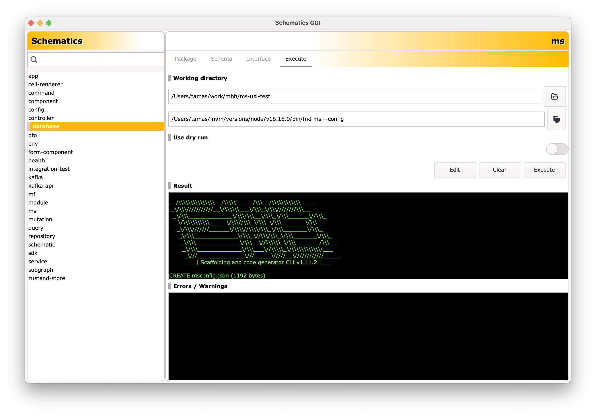

# Usage instructions

<!-- vscode-markdown-toc -->
* 1. [Configuration, initial setup](#Configurationinitialsetup)
	* 1.1. [Schematics package and collection options](#Schematicspackageandcollectionoptions)
	* 1.2. [Choosing runner type](#Choosingrunnertype)
	* 1.3. [A note about custom runner](#Anoteaboutcustomrunner)
	* 1.4. [Optional settings](#Optionalsettings)
* 2. [Browsing schematics](#Browsingschematics)
* 3. [Schema viewer](#Schemaviewer)
* 4. [Schematic UI](#SchematicUI)
* 5. [Managing profiles](#Managingprofiles)
	* 5.1. [Saving profiles](#Savingprofiles)
	* 5.2. [Loading profiles](#Loadingprofiles)
* 6. [Executing a schematic](#Executingaschematic)
	* 6.1. [Running schematics using directives](#Runningschematicsusingdirectives)
* 7. [Configurable schematics (FND tool only)](#ConfigurableschematicsFNDtoolonly)
	* 7.1. [Schema requirements](#Schemarequirements)

<!-- vscode-markdown-toc-config
	numbering=true
	autoSave=true
	/vscode-markdown-toc-config -->
<!-- /vscode-markdown-toc -->

##  1. <a name='Configurationinitialsetup'></a>Configuration, initial setup

Starting up the app for the first time look like this:


In order to use it, you have to configure the app first. You need to do this only once, the settings dialog won't be shown (automatically) next time, but you may open it any time by pressing `CTRL + S`.

You may probably leave all options as defaults, except for:

- **node executable**: this should point to wherever the NodeJS binary is installed.
- **schematics collection**: this should point to the `collection.json` of the schematics package you wanna use.
- **schematics package**: this should point to the `package.json` of the schematics package you wanna use.
- **schematic runner**: This should point to the executable of the schematics CLI you wish to use.

###  1.1. <a name='Schematicspackageandcollectionoptions'></a>Schematics package and collection options

If you just wanna generate a GUI for some 3rd party schematics package, you should point these to wherever that package is installed. Please note that currently you must install all schematics packages you want to use with the GUI **globally**, unless the custom schematics CLI you are using allows local packages. 

On the other hand, if you are the author of a schematics package, the two paths should point to the directory where your source code lives (e.g.: `/some/path/my-package/package.json` and `/some/path/my-package/<build_dir>/collection.json`, respectively). This would allow you make changes in the schemas of your schematics and see those changes reflected in the GUI immediately. Every time you choose an item from the schematics browser list, the corresponding schema would be re-parsed, so all changes would show up in the UI instantly. This is especially useful for customizing the UI using the `x-widget` property and for making various other changes as well. 


###  1.2. <a name='Choosingrunnertype'></a>Choosing runner type

Choose the `Google` runner if you are using [Google Schematics CLI](https://www.npmjs.com/package/@angular-devkit/schematics-cli) or the `MBH` runner, if you are working with the FND tool. Set type to `Custom` only if your custom runner meets the following requirements:

###  1.3. <a name='Anoteaboutcustomrunner'></a>A note about custom runner 

- The runner accepts input as CLI flags
- When flag is provided, the corresponding prompt won't be shown
- Boolean flags can be negated using the `no-xy` syntax
- CLI command follows this pattern: `/path/to/executable schematicName --flag1 --flag2`

If your runner doesn't work, [let us know](https://github.com/gtamas/schematicsgui/issues)

###  1.4. <a name='Optionalsettings'></a>Optional settings

There are some options you may change if you want, but you don't have to. These are as follows:

- **Show private / hidden**: If enabled, private and hidden schematics will be listed in the schematic browser, otherwise these won't show up. Normally, you can't run these using the CLI either, so only enable this if you know what you are doing.

Once you are ready, click `Save` to persist the settings.

If you wish to modify the config later, you may re-open this dialog anytime from the app menu or by pressing `CTRL+S`.

##  2. <a name='Browsingschematics'></a>Browsing schematics

Once the settings are saved, the schematics browser should show up. This is also what you'll see whenever you  start the app after initial setup.


 On the left, there should be a list of all schematics available in this package. You can filter the list using the **search bar** at the top.
 On the right, you should see an overview of the package, providing general info.

 Select the schematic you wish to run by **clicking its name**. This should activate the `Interface` and the `Schema` tabs.

##  3. <a name='Schemaviewer'></a>Schema viewer

Once a schematic is selected, you can review its JSON schema. This should be visible in the `Schema` tab and should look something like this:


This is a read-only view and serves only as reference.


##  4. <a name='SchematicUI'></a>Schematic UI

The `Interface` tab is also active now. It should display a GUI similar to the one below:


This UI was auto generated using the JSON Schema of the given schematic. Each input corresponds to a property of the schema and the type of the input widget maps to the data type of that schema property. If you wanna know more about about how the default UI is generated or you **wish to customize** the UI to better fit your needs, check out [this page](./UI.md) for details.

The generated UI should consist of input fields your schema defines. The `x-prompt` or `description` schema props have been turned into labels and all fields are either blank or a default value is displayed (if such value exists in the schema).

Go ahead and fill in the form to provide all the necessary input for your schematic. If you leave a field blank, the value of that field will be omitted from the output (see execution).

Please note that there is no validation (for now). It's up to you to fill in all mandatory fields.

##  5. <a name='Managingprofiles'></a>Managing profiles

The current configuration of a schematic can be saved to disk and loaded later. This way you can store frequently used settings and easily reload them when needed, in which case the UI will be automatically populated for you.

###  5.1. <a name='Savingprofiles'></a>Saving profiles

To use this feature, simply fill the form and then click `Save` at the bottom the UI. The following screen should appear:


Click `browse` and specify a file name for this profile. You may use any name you like, but please note that you **must** use the `.toml` extension as shown below. Also make sure you **do not** change the root directory of the file. That would not work, since the app stores these settings in a pre-defined directory structure.


Yu may also provide a short `description` for the profile, but this not mandatory. Once you are ready, click `Save`.

###  5.2. <a name='Loadingprofiles'></a>Loading profiles

As soon as at least 1 profile exists, the `Load` button appears at the bottom of the UI. Clicking it brings up the profile browser:


As you can see, all profiles are listed here. Clicking one of them instantly loads it and populates the UI accordingly. The profile URL also gets displayed at the top of the screen.

Once a profile is loaded, you can make changes and update it (using `Save`) or clone and save it under a different name (using `Save as`). The `Hide` button closes the profile browser.

##  6. <a name='Executingaschematic'></a>Executing a schematic

Once you filled the form or loaded a profile, you can run the schematic with those settings. To do that, simply click `Submit` at the bottom. Now the `Execute` tab becomes active:


There are 3 important things on this screen:

First, you need to browse the **working directory**. This is where the schematic will be executed.

Below the CWD path input, you can see the CLI command to execute. This was generated using the input collected from UI. You can **copy this to the clipboard** using the icon on the left.

Finally, when everything is set, click `Execute`. 

This will run the CLI of your choice with the specified command and the schematic gets executed. If you are using Google CLI or FND, you can also activate the `dry run` option. This will run the schematic on a virtual FS, so nothing gets synced to disk. This is useful for testing purposes, to see what changes would be made without actually changing anything.

###  6.1. <a name='Runningschematicsusingdirectives'></a>Running schematics using directives

This app supports a few [directives](./UI.md#281-items-special-syntax) representing special values. These can be used in the `schema.json` of any schematic. Executing such schematics requires the current working directly to be specified first. Once the UI gets loaded, you'll see a link at the top and the `Submit` button will be inactive. Click the link and choose a CWD. Once this is done, you can go back to the `Interface` tab and fill the form as you normally would. 

##  7. <a name='ConfigurableschematicsFNDtoolonly'></a>Configurable schematics (FND tool only)

If you are working with the FND tool, you can generate and edit JSON config files for schematics supporting this. In order to use this functionality, your schema must look like this:

###  7.1. <a name='Schemarequirements'></a>Schema requirements

First, you need to have this attribute at the top level:

```json
"configurable": "config",
```
Here `config` is the name of a boolean option responsible for config generation. You can use any name your schematic supports.

Next, the above mentioned property must exist in your schema:

```json
 "config": {
    "type": "boolean",
    "description": "Generate xy config file",
    "default": false
  },
```

When this option is `true`, the schematic must output a JSON config file without raising any prompts.

Finally, the `path` option in your schema must have a default value. It'll be used as the file name of the generated config file.

```json
 "path": {
    "type": "string",
    "format": "path",
    "minLength": 1,
    "description": "Path to the config file",
    "default": "msconfig.json"
  },
```

Once you have these, the UI should generate a switch widget for the `config` prop. Turning that on allows you to generate the config file using the `Execute` tab. No need for filling in any of the other input fields.


Now go to execute tab and press `Execute`:



Once the config file is ready, you can go back to the `Interface` tab and open up the **config editor**.
Change the config file in any way you like then click `Save`. 


Finally, turn off the `config` switch and hop over to `Execute` tab again. Running your schematic now will generate the expected results using the config file.

This function will be extended in the future, so you may use other config formats than JSON and it'll be also simpler to use.

